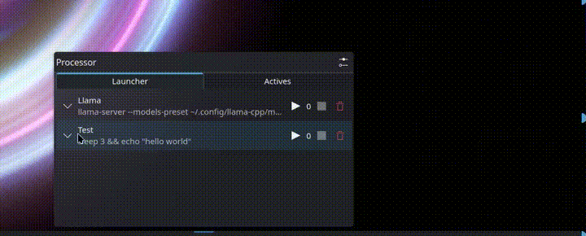

# Processor

Widget for the KDE Plasma desktop environment that lets the user save commands that they often use and relaunch them with a click. The widget also lets the user save different presets to customize their save commands before running them. The widgets save the stdout of the processes run this way so that it can track them easily in the interface.

